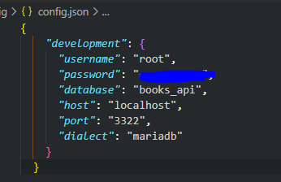
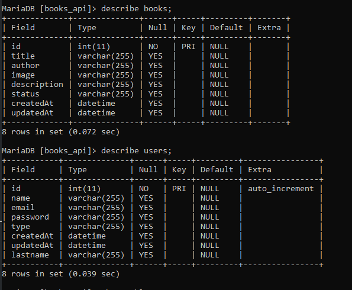
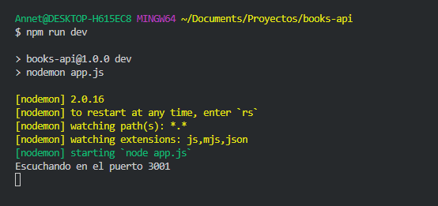
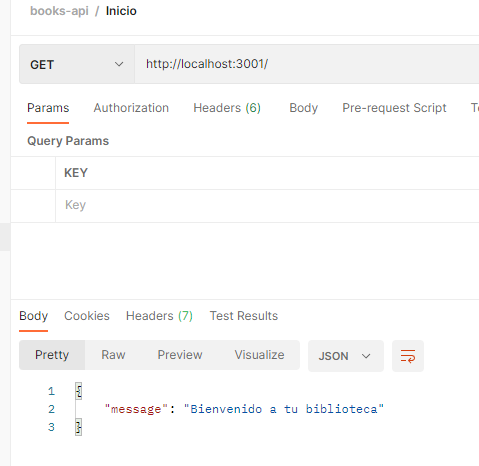
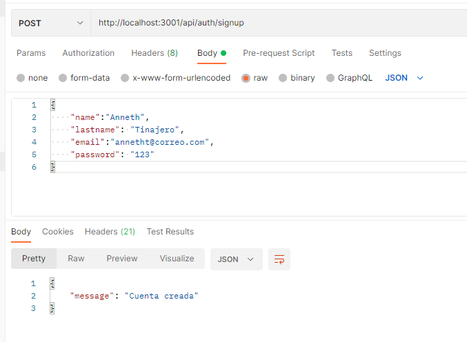
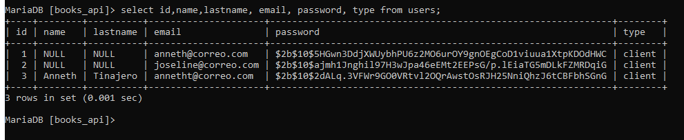
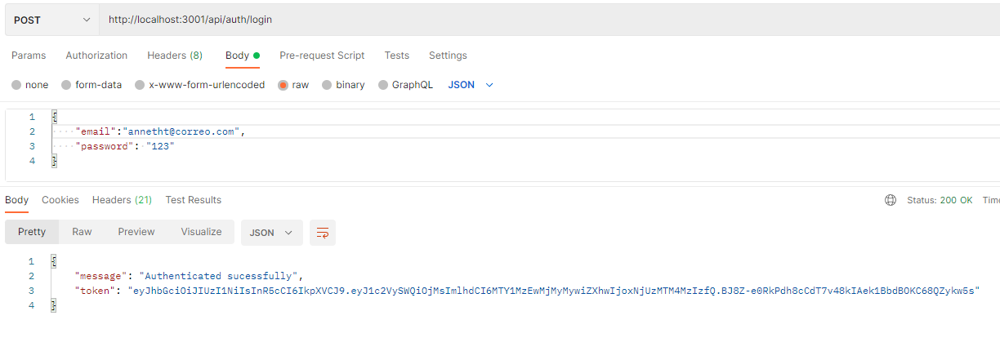
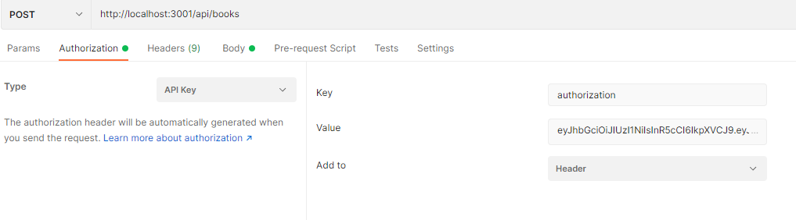
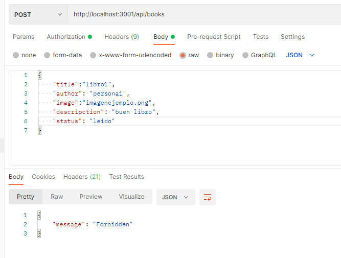

# Bedu / books-api

### Idea del Proyecto

Un directorio de libros, donde necesitaría crear puntos finales, utilizando los cuatro métodos más básicos: GET, POST, PUT y DELETE.

Usaría GET para obtener todos los libros. Con el método POST, puede agregar un nuevo libro a la lista. Necesitaría el método PUT para actualizar el libro existente, y es evidente que con el método DELETE, eliminará el libro de la lista.

Una pequeña idea a la pagina de Goodreads https://www.goodreads.com/

### Requerimientos del proyecto

**Proyecto personal con mínimo dos necesidades,** con las estructuras en:
routes
models
migrations
middlewares
configuración de sequelize db.js
configuraciones en su modulo principal app.js

---

## Necesidades

### Books

- Id
- Title
- Author
- Image (url)
- Description
- Status
- Url (al sitio de compra)
- CreatedAt
- UpdatedAt

### Users

- Id
- Name
- Last name
- Email
- Password
- CreatedAt
- UpdatedAt

---
##Seguimiento de la API
 - Teniendo listo el proyecto, las dependencias listas y los modelos, hacemos migraciones de las tablas users y books con el comando:
 ./node_modules/.bin/sequelize migration:create --name 

- Generamos /config/config.json, de aqui sequelize obtendra los datos para poder hacer conexion a la base de datos

- Generamos la migracion con el comando:
./node_modules/.bin/sequelize db:migrate

---
## Pruebas PostMan

 

- Escuchando en el puerto y bienvenida…
    
    
    
    
    
- SignIn
    
    
    
    
    
- LoginIn
    
    
    

- Para alguna accion del CRUD debemos tener registrado el token:

    

    No pude realizar alguna prueba del CRUD ya que me negaba el acceso, revise bien pero no encontre el error
    
    